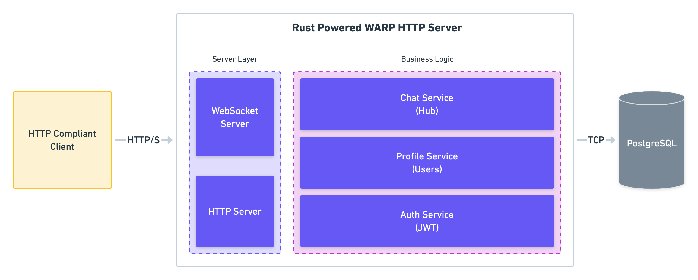

  

    
  

  <h1 align="center">hoth-server</h1>
  <h4 align="center">
    The Hoth project aims to develop a realtime chat application using WebSocket and asynchronous channels from Tokio. This repository contains the Back-End logic for the application
  </h4>

  
  

## Documentation

- [Setup](https://github.com/EstebanBorai/hoth-server/wiki/Setup)
- API
  - [Register and Login](https://github.com/EstebanBorai/hoth-server/wiki/Register-and-Login)

## Architecture

  

